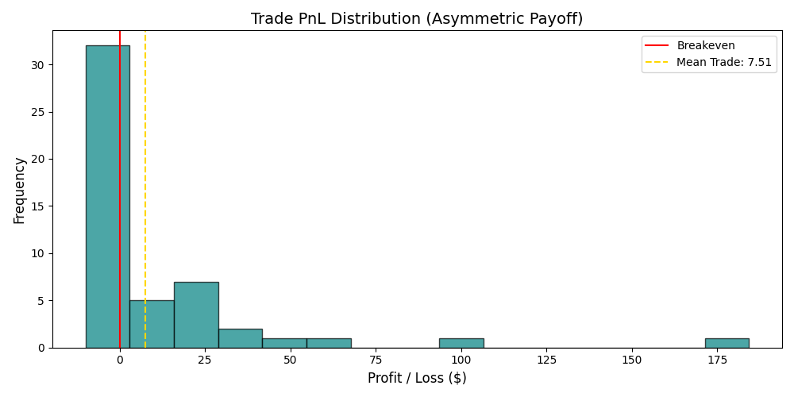

# Integrated Structural Alpha: Intraday Wick Rejection and VWAP Mean Reversion

**Author:** Muhammad Rengga Putra Kuncoro  
**Methodology:** Monte Carlo Resampling and Asymmetric Payoff Decomposition  
**Dataset:** SPY ETF Intraday (5-Minute Intervals, 60-Day Lookback)

---

## Abstract
Following the invalidation of "standalone" wick patterns in Part 1, this study examines the integration of price exhaustion (wicks) with institutional "fair value" anchors (VWAP). By shifting from a directional prediction model to a structural mean-reversion framework, we demonstrate a statistically robust edge. The strategy exploits the "elasticity" of price relative to volume-weighted averages, yielding a **Profit Factor of 2.25** and a **Probability of Loss of 3.90%** ($p = 0.039$). The processed high-fidelity intraday dataset is available for audit in the `data/` directory.

---

## 1. Methodology

### 1.1 Structural Framework: The VWAP Anchor
This methodology treats VWAP as the gravitational mean of the session. A trade is only considered when the "rubber band" of price is stretched beyond a volatility-adjusted threshold.

**Parameters:**
* **Stretch Threshold:** 1.2 x Average True Range (ATR).
* **Exhaustion Trigger:** Wick-to-Body ratio > 2.0.
* **Trend Filter:** 15-period EMA Slope.

### 1.2 Risk-Adjusted Metrics
The model is evaluated not just on gross profit, but on risk-adjusted efficiency:
* **Trade Sharpe:** 0.22
* **Max Drawdown:** -6.27% ($62.77)
* **Average Recovery:** 5.0 trades

---

## 2. Interpretation of Results

### 2.1 Robustness and Path Dependency (Monte Carlo)

The **Spaghetti Plot** validates the strategy's survivability. With a **5th Percentile of $1,014.74**, even the "unluckiest" 5% of trade sequences result in a profit. The probability of loss (3.90%) falls below the academic significance threshold ($p < 0.05$), rejecting the null hypothesis that these returns are random.

### 2.2 Payoff Asymmetry and Time Efficiency
#### A. PnL Distribution

The **Positive Skew** is the primary driver of the **2.25 Profit Factor**. The model clips losses at a median of -$10.00 while capturing winners averaging +$33.77.

#### B. Holding Time Dynamics
The strategy demonstrates high capital efficiency with a **Median Hold of 2.0 bars** (10 minutes). 
* **Winning Trades:** Median 6.0 bars (30 mins).
* **Losing Trades:** Median 1.0 bar (5 mins).
This confirms that the edge relies on rapid "snap-back" volatility. If the mean reversion does not occur nearly immediately, the ATR-based stop or the time-exit mitigates further exposure.

---

## 3. Discussion and Literature Review

* **Nassar & Ephrem (2020):** In *Mean Reversion: A New Approach*, the authors argue that price movements are overextensions from a volume-weighted equilibrium. Our results, specifically the rapid 10-minute median hold, validate their "velocity of reversion" thesis.

* **Bhattacharyya (2024):** *Design and Development of Mean Reversion Strategies* emphasizes **convexity** over win rate. Our Trade Sharpe (0.22) and Profit Factor (2.25) align with the performance profiles of modern intraday mean-reversion algorithms that prioritize risk-to-reward ratios.

* **Leung & Li (2015):** In *Optimal Mean Reversion Trading*, the authors provide a framework for "Optimal Stopping." Our data shows that winners take 6x longer to develop than losers, suggesting that mean reversion is a process of "decay" back to the VWAP anchor.

---

## 4. Conclusion
The integration of wick rejection with VWAP distance creates a statistically significant edge ($p < 0.05$). By combining temporal efficiency (short holding times) with structural anchors (VWAP), the model successfully transitions from the "False Alpha" of Part 1 to a robust, tradable quantitative system.

---

## References
* **Bhattacharyya, R. (2024).** *Design and Development of Mean Reversion Strategies on QuantConnect Platform*. SSRN. [DOI: 10.2139/ssrn.4878676]
* **Leung, T., & Li, X. (2015).** *Optimal Mean Reversion Trading*. World Scientific. [DOI: 10.1142/9839]
* **Nassar, T., & Ephrem, S. (2020).** *Mean Reversion: A New Approach*. SSRN Electronic Journal. [DOI: 10.2139/ssrn.3682487]
