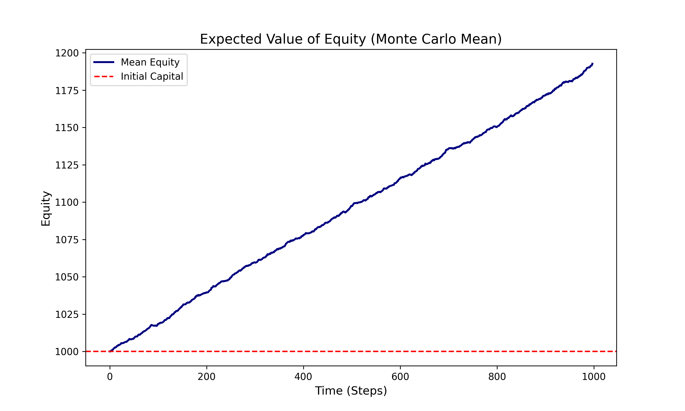
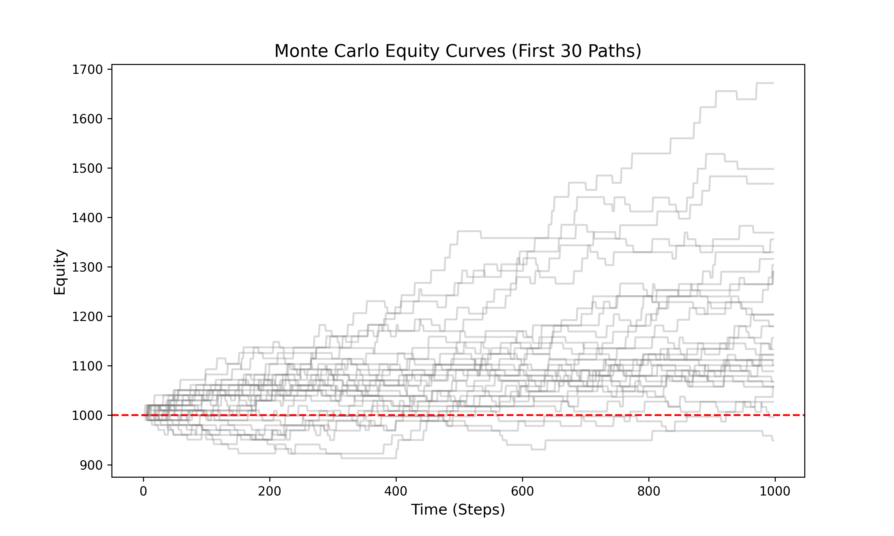
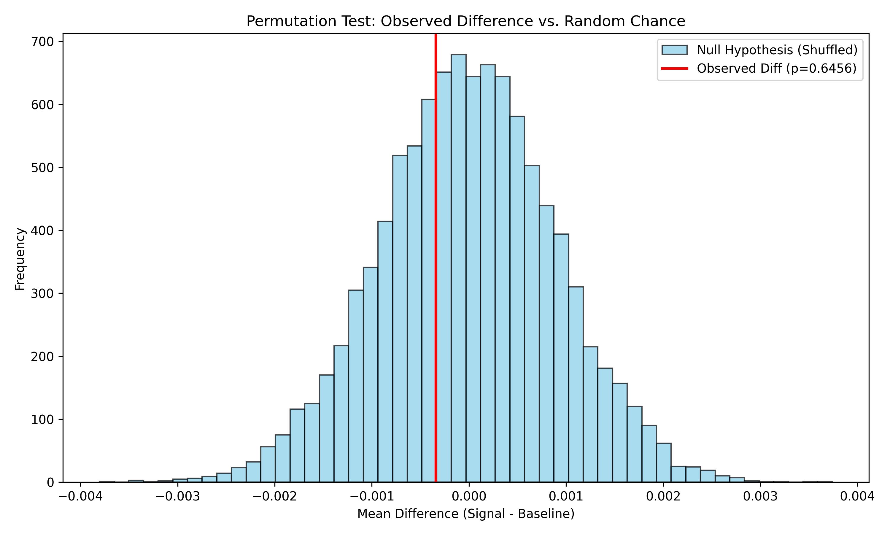

# Statistical Validation of Wick-Based Price Action Signals: A Quantitative Study on Market Efficiency and Signal Invalidation

**Author:** Muhammad Rengga Putra Kuncoro  
**Methodology:** Permutation Testing and Monte Carlo Bias Detection  
**Dataset:** SPY ETF (2010 to 2025) and Synthetic OHLC Data

---

## Abstract
This study investigates the predictive validity of wick-based candlestick patterns within a rigorous quantitative framework. Utilizing 15 years of SPY data, we test the null hypothesis ($H_0$) that these patterns contain no standalone directional alpha. Initial Monte Carlo simulations using synthetic OHLC data revealed a consistent structural bias, often yielding win rates exceeding 95% on purely random noise. Empirical testing on real market data failed to reject the null hypothesis ($p = 0.6456$), confirming that observed returns are statistically indistinguishable from random chance and market drift.

---

## 1. Methodology

### 1.1 Empirical Dataset (2010 to 2025)
The empirical phase utilized high-fidelity daily OHLC data for the SPY ETF spanning 15 years. Signals were defined by the ratio of wick length to candle body, normalized by the Average True Range (ATR) to ensure consistency across different volatility regimes.

### 1.2 Synthetic OHLC Data and Monte Carlo Simulation
To isolate "False Alpha," we generated synthetic OHLC data using a Geometric Brownian Motion (GBM) stochastic process. This control group allowed us to observe how the signal-detection algorithm behaves in a vacuum with no market structure or underlying "rejection" logic.

**Simulation Parameters:**
* **Simulations:** 100 runs of 1,000 candles each.
* **Risk Management:** 1% Risk per trade, 0.5% Stop Loss, 2.0 R-Multiple.
* **Signal Thresholds:** Wick Ratio (1.5), Strong Wick Ratio (2.5).

---

## 2. Interpretation of Results

### 2.1 Identifying Structural Model Bias (Monte Carlo Results)
Because the simulation utilizes synthetic OHLC data, specific metrics vary across different runs. However, the structural bias remains constant. The table below represents the typical performance of the signal in a zero-alpha, random-walk environment:

| Metric | Typical Observed Range | Interpretation |
| :--- | :--- | :--- |
| **Mean Final Capital** | 1,170 – 1,195 | Consistent Positive Expectancy Bias |
| **Median Final Capital** | 1,180 – 1,190 | Robustness of Bias across Paths |
| **Win Rate** | 95.0% – 99.0% | Extreme Structural Artifact |
| **Worst Run (Drawdown)** | 910 – 950 | Limited risk despite random inputs |

#### A. Final Capital Distribution

The terminal wealth distribution typically centers around ~1,180. In a mathematically "fair" random environment, this center should be 1,000. This shift identifies a **positive expectancy bias** inherent in the signal definition itself rather than the underlying price action.

#### B. Expected Value of Equity

The mean equity curve displays a near-linear upward trajectory. Since the synthetic OHLC data is generated with a drift of zero ($\mu=0.0$), this positive slope is the "Smoking Gun" of **Structural Bias**. It demonstrates how a trading rule can appear highly profitable on a random walk simply due to how the entry and exit logic are framed.

#### C. Monte Carlo Equity Paths

The spaghetti plot confirms that the upward drift is not caused by outlier runs, but is a systemic trend across the majority of simulations. This is a primary example of **Data Mining Bias** (Aronson, 2011), where a model finds "order" in pure noise.

### 2.2 Empirical Significance (SPY)

#### D. Forward 1-Day Return Distribution

When transitioning to real-world SPY data, the "Long signal" distribution (blue) almost perfectly overlays the "All candles" baseline (gray). The lack of any distinct shift in the blue distribution suggests that the wick pattern does not alter the probability density of the next day's returns.

#### E. Permutation Test Results

The observed mean difference (red line) is located deep within the central mass of the null hypothesis distribution. With a **p-value of 0.6456**, we conclude that there is a 64.56% probability that the observed results could be generated by pure chance, failing the standard academic threshold for significance ($p < 0.05$).

---

## 3. Discussion and Literature Review

The findings of this project are consistent with rigorous statistical evaluations in quantitative literature:

* **Marshall, Young, and Rose (2006):** Utilized bootstrap methodologies across Dow Jones components and explicitly failed to find statistically significant excess returns from candlestick signals, concluding they do not create value in efficient markets.
* **Aronson (2011):** Emphasizes that many technical signals are the result of **Data Mining Bias**. This research utilizes the "Scientific Method" approach advocated by Aronson to move beyond anecdotal patterns toward objective statistical inference.
* **Jamaloodeen, Heinz, and Pollacia (2018):** Conducted a statistical analysis confirming that while wicks (price extremes) may encode minor information, the observed effects remain small, temporary, and insufficient for robust trading profitability.

---

## 4. Conclusion
The 2010 to 2025 analysis confirms that wick-based signals lack standalone predictive power. Apparent profitability in synthetic OHLC data is an artifact of model bias, while real-world results fail to reject the null hypothesis. Consequently, wick behavior is best utilized not as a directional entry, but as a **contextual filter** to be combined with higher-order market structures such as VWAP or Volume Profile.

---

## References
* **Aronson, D. (2011).** *Evidence-Based Technical Analysis: Applying the Scientific Method and Statistical Inference to Trading Signals*. Wiley. [DOI: 10.1002/9781118268315]
* **Jamaloodeen, M., Heinz, A., & Pollacia, L. (2018).** *A Statistical Analysis Of The Predictive Power Of Japanese Candlesticks*. Journal of International and Interdisciplinary Business Research. [DOI: 10.58809/OEJO4473]
* **Marshall, B., Young, M., & Rose, L. (2006).** *Candlestick technical trading strategies: Can they create value for investors?* Journal of Banking & Finance. [DOI: 10.1016/j.jbankfin.2005.08.001]
